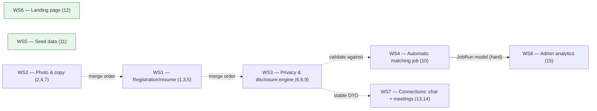

# SamePath — Parallel Work Plan

Planning document only. No application code was modified to produce this
plan. It maps all 15 backlog items to concrete files, flags merge-conflict
hotspots, and proposes workstreams a team could pick up in parallel.

---

## 1. Repository architecture overview

Next.js 16 App Router + React 19 + TypeScript, Postgres via Prisma 7
(`@prisma/adapter-pg`), Tailwind 4. A modular monolith: every domain lives
under `src/modules/<name>/` with a consistent internal shape (see
`docs/architecture-decisions.md`):

- **Pure logic files** — no DB, no framework import (e.g. `privacy/engine.ts`,
  `matching/scoring.ts`, `resumes/deterministic-parser.ts`). Fully
  unit-testable, importable from `prisma/seed/*.ts`.
- **`service.ts`** — `server-only`, the real DB-backed logic.
- **`actions.ts`** — `"use server"`, thin zod validation, calls `service.ts`,
  owns cookies/redirects/revalidation.
- **`*.tsx`** — client components for anything interactive.
- **`__tests__/`** — co-located Vitest unit + integration tests.

Routes live under `src/app/**`: `src/app/_marketing` (public landing page,
composed into `src/app/page.tsx`), `src/app/register` / `login` /
`forgot-password` / `reset-password` (auth), `src/app/app/**` (authenticated
shell: onboarding, matches, connections, groups, guides, interviews,
settings, credits, access), `src/app/admin/**` (moderator/admin area),
`src/app/api/**` (currently only Google OAuth + account export route
handlers — everything else is Server Actions, not REST routes).

There is **no i18n library**. Hebrew/English/mixed copy is hardcoded inline
in component JSX; RTL is set once at the root (`src/app/layout.tsx`,
`<html lang="he" dir="rtl">`) with no locale toggle. There is **no
background-job/cron/queue infrastructure anywhere** — every "async" step
(resume extraction, access-pass expiry) runs synchronously inline in the
relevant request path (`docs/architecture-decisions.md` documents this as
deliberate for the current MVP scope).

The privacy model is deliberately structural, not a filter that can be
forgotten: `src/modules/profiles/dto.ts`'s `toPreMatchDTO`/`toPostMatchDTO`
produce TypeScript types that **cannot carry** forbidden fields pre-match —
the fields simply aren't in the input type. `src/modules/privacy/engine.ts`
is a pure hard-filter function (same-company, blocked-company,
corporate-group, blocked-user) run before any compatibility scoring in
`src/modules/matching/`. This structural approach is the main reason several
backlog items (6, 8, 9, 13) all converge on the same small set of files —
identity/visibility logic is intentionally centralized, not duplicated.

Testing: Vitest (`pnpm test`, real `.env.test` Postgres DB, `TRUNCATE`-reset
between tests, `fileParallelism: false` — tests run sequentially against a
shared DB) plus `src/shared/test/fixtures.ts` for integration fixtures.
Playwright e2e (`pnpm e2e`, 3 specs) runs against the **dev** DB seeded via
`prisma/seed.ts` (`pnpm db:seed`), not the throwaway test DB — e2e specs
depend on specific seeded rows (e.g. `admin@example.com`).

---

## 2. Backlog-to-code mapping

Each item lists: frontend files, backend files, DB tables/migrations, shared
types/services/tests, dependencies on other items, files likely to
conflict, and a parallel-safety classification.

### Item 1 — Resume extraction

- **Frontend**: `src/modules/resumes/ResumeUploadCard.tsx`,
  `ResumeDraftReview.tsx`, `ResumeVerifyCard.tsx`;
  `src/app/app/onboarding/profile/page.tsx`;
  `src/modules/profiles/ProfileStepOneForm.tsx`;
  `src/app/app/settings/profile/page.tsx`.
- **Backend**: `src/modules/resumes/service.ts` (`uploadResume`,
  `runExtractionJob`, `confirmResumeDraft`, `discardResumeUpload`),
  `text-extraction.ts` (`pdf-parse` / `mammoth`), `deterministic-parser.ts`
  (pure regex parser — **currently the only implementation**; the schema's
  `ParserSource.AI` value is never written), `malware-scan.ts`, `dto.ts`,
  `actions.ts`. Cross-module call into
  `src/modules/companies/service.ts#resolveOrCreateCompanyByRawName`.
- **DB**: `ResumeUpload`, `ResumeExtractionJob` (`ResumeJobStatus`),
  `ResumeExtractionDraft` (`ParserSource`), `EmploymentPosition`
  (`EmploymentSource`), `UserConfirmation`, `ProfessionalProfile.cvVerifiedAt`
  / `.shortIntro`. All defined in the base `20260827183731_init` migration;
  no dedicated resume migration exists yet.
- **Shared**: `src/shared/storage.ts`, `src/shared/rate-limit.ts`,
  `src/shared/ui/CvVerifiedBadge.tsx`. Tests:
  `src/modules/resumes/__tests__/*`, `e2e/resume-onboarding.spec.ts`,
  `e2e/helpers/pdf-fixture.ts`.
- **Known gap driving the "recommend an approach" ask**: the parser never
  produces education, precise location, or a summary, and
  `shortIntro`/`professionalFieldId`/`targetRoleIds` are hardcoded blank/
  default in `onboarding/profile/page.tsx` lines 37–57 regardless of what
  was uploaded — see the recommendation in §12 (Integration/validation
  section) for the suggested hybrid approach.
- **Depends on**: none. Shares files with items 3 and 5 (same onboarding
  page/module) — see hotspots.
- **Conflict files**: `src/app/app/onboarding/profile/page.tsx`,
  `ProfileStepOneForm.tsx`, `src/modules/profiles/service.ts`.
- **Classification**: Safe to implement in parallel (own workstream), with
  internal coupling to items 3 and 5.

### Item 2 — Profile-photo upload

- **Frontend**: `src/modules/profiles/ProfilePhotoUploadCard.tsx` (the
  entire fix is contained here); embedded (unchanged interface) in
  `PrivacyStepForm.tsx` and `PrivacySettingsForm.tsx`.
- **Backend**: `src/modules/profiles/photo.ts` (`uploadProfilePhoto`,
  `deleteProfilePhoto`, `getOwnProfilePhotoDataUrl`), reusing
  `getMalwareScanner()` from `resumes/malware-scan.ts` and
  `getStorage()`/`generatePhotoStorageKey` from `src/shared/storage.ts`;
  `src/modules/profiles/actions.ts` (`uploadProfilePhotoAction`,
  `deleteProfilePhotoAction`).
- **DB**: `IdentityDisclosurePreference.photoStorageKey` /
  `.photoMimeType` (migration `20260905101446_add_profile_photo`). No new
  migration expected — this is a UX/mechanics fix, not a data-model change.
- **Shared**: `src/shared/ui/Avatar.tsx` (fallback), `src/shared/rate-limit.ts`.
  **No existing tests** for photo upload — a coverage gap to close.
- **Current gap driving the fix**: unlike the resume card's one-step
  "pick file → uploads immediately," the photo card is two-step (pick →
  separate upload button) and renders the raw `<input type="file">` instead
  of a styled trigger; no staged progress labels.
- **Depends on**: none functionally. Shares its embedding files with items
  4, 5, 6, 8, 9 — see hotspots.
- **Conflict files**: `PrivacyStepForm.tsx`, `PrivacySettingsForm.tsx` (only
  the props passed into `<ProfilePhotoUploadCard>`, not its internals).
- **Classification**: Safe to implement in parallel; pair with item 4 (same
  component + adjacent copy).

### Item 3 — Registration back navigation

- **Frontend**: `src/app/app/onboarding/layout.tsx`,
  `src/app/app/onboarding/profile/page.tsx`,
  `src/modules/profiles/ProfileStepOneForm.tsx`,
  `src/modules/profiles/PrivacyStepForm.tsx` (the existing but currently
  dead-end back-link at line 128).
- **Backend**: `src/modules/profiles/service.ts` — `getOnboardingStep`
  (lines 403–412, the actual bug: once `saveProfileStepOne` flips
  `ProfessionalProfile.status` from `DRAFT` to `PENDING_PRIVACY`, this
  function permanently reports `"privacy"`, so the profile page's own guard
  redirects the user straight back forward), `saveProfileStepOne`,
  `getProfileEditData` (the existing pre-fill pattern already used
  correctly by `src/app/app/settings/profile/page.tsx` — reuse it here).
- **DB**: `ProfessionalProfile.status` (`ProfileStatus` enum) — no new
  migration needed; this is a state-machine/UI fix, not a schema fix.
- **Shared**: none beyond the above. **No test coverage** — both e2e
  onboarding specs only exercise the forward path.
- **Depends on**: tightly coupled with items 1 and 5 (same
  page/component/service functions) — recommend one owner for all three.
- **Conflict files**: same as item 1.
- **Classification**: Must be implemented together with items 1 and 5
  (single workstream); safe relative to every other backlog item.

### Item 4 — Optional-photo explanation

- **Frontend**: the explanatory paragraph immediately preceding
  `<ProfilePhotoUploadCard>` in `PrivacyStepForm.tsx` (~line 179) and
  `PrivacySettingsForm.tsx` (~line 149) — **this is the exact same
  paragraph that item 7 needs to edit** (see below).
  `src/shared/ui/Avatar.tsx` (DiceBear voxel-art fallback, already wired via
  `avatarFallbackSeed`).
- **Backend**: none — copy-only change.
- **DB**: none.
- **Shared**: none new. No existing tests for this copy or `Avatar.tsx`.
- **Depends on**: coupled with item 7 (identical location).
- **Conflict files**: `PrivacyStepForm.tsx`, `PrivacySettingsForm.tsx`
  (shared with items 2, 5, 6, 8, 9 — see hotspots).
- **Classification**: Must be implemented together with item 7; safe in
  parallel relative to other backlog items.

### Item 5 — Remove résumé-saving UI duplication

- **Frontend**: **first occurrence** —
  `src/modules/resumes/ResumeDraftReview.tsx` (lines 39, 69–74, `keepFile`
  checkbox, onboarding). **Second occurrence** —
  `src/modules/profiles/PrivacyStepForm.tsx` (lines 244–261, the "שמירת
  קורות חיים" `DELETE_AFTER_CONFIRMATION`/`KEEP` radio section). **Do not
  touch** the equivalent, legitimate, standalone section in
  `PrivacySettingsForm.tsx` (~lines 210–221) — that one is the real
  general "future upload preference" setting, not a duplicate.
- **Backend**: `src/modules/resumes/service.ts#confirmResumeDraft` (acts on
  `keepFile` immediately), `src/modules/profiles/service.ts` (persists
  `ProfessionalProfile.resumeRetentionPreference` from the onboarding
  section being removed) — the two independent code paths controlling
  overlapping intent should collapse into one (keep the earlier,
  in-context, upload-time decision; delete the later redundant one).
- **DB**: `ProfessionalProfile.resumeRetentionPreference`
  (`ResumeRetentionPreference` enum) — no migration needed, just stop
  writing to it from the deleted onboarding section.
- **Shared**: `src/modules/resumes/actions.ts`,
  `src/modules/profiles/actions.ts`.
- **Depends on**: coupled with items 1 and 3 (same workstream).
- **Conflict files**: `PrivacyStepForm.tsx` (shared with 2/4/6/8/9 — a
  *different*, clearly-delimited section of the file from those items).
- **Classification**: Must be implemented together with items 1 and 3.

### Item 6 — Remove corporate-group blocking

- **Frontend**: the "לחסום את כל קבוצת החברות" toggle in
  `PrivacyStepForm.tsx` (~line 82) and `PrivacySettingsForm.tsx` (~lines 45,
  86).
- **Backend**: `src/modules/privacy/engine.ts:163–172` — the exact `if`
  block inside `evaluatePrivacy()` computing corporate-group conflict and
  rejecting with `reasonCode: "corporate_group_conflict"`. Sits cleanly
  between the same-company check (line 159, **preserve**) and the
  blocked-company/blocked-user checks (174–186, **preserve**) — a
  self-contained deletion. `src/modules/privacy/context.ts:35–36` (stop
  loading `currentCompanyCorporateGroupId` / `blockEntireCorporateGroup` if
  no longer needed, or leave unused per the codebase's own
  don't-remove-things-you-don't-have-to convention — see §8).
  `src/modules/profiles/service.ts` /`actions.ts`
  (`completePrivacyOnboarding`, `updatePrivacySettings` — stop reading the
  toggle).
- **DB**: `PrivacyPreference.blockEntireCorporateGroup` — **recommend
  leaving the column in place** (default `true`, simply unused) rather than
  a destructive migration; matches the codebase's existing pattern of
  keeping unused enum values (see `VerificationPurpose.LOGIN`'s own comment:
  "kept to avoid a Postgres enum-value-removal migration").
- **Shared**: `src/modules/companies/service.ts#getCorporateGroupCompanyIds`
  is a separate, already-unused-in-production helper — no change needed.
  Tests: `src/modules/privacy/__tests__/engine.test.ts` (3 tests to remove/
  update), `context.integration.test.ts`, `profiles/__tests__/
  service.integration.test.ts`. Seed fixtures exercising this:
  `prisma/seed/users.ts` (dana/yossi same-company, noa subsidiary),
  `prisma/seed/companies.ts` (Northwind parent/subsidiary group) — coordinate
  with item 11.
- **Depends on**: bundled with items 8 and 9 (same files, same conceptual
  area: privacy/disclosure engine).
- **Conflict files**: `PrivacyStepForm.tsx`, `PrivacySettingsForm.tsx`,
  `privacy/engine.ts`.
- **Classification**: Safe only alongside a shared prerequisite — bundle
  with items 8/9 under one owner to avoid two people editing
  `engine.ts`/the privacy forms at once.

### Item 7 — Remove specific copy

- **Frontend**: `src/modules/profiles/PrivacySettingsForm.tsx:149` and
  `PrivacyStepForm.tsx:179` — confirmed the **only two occurrences**
  repo-wide (re-grepped `src` and `e2e`, including the sentence fragment).
  No test asserts on this string.
- **Backend / DB**: none.
- **Depends on**: identical location to item 4 — implement as one atomic
  copy edit.
- **Conflict files**: same two form files.
- **Classification**: Must be implemented together with item 4.

### Item 8 — Reciprocal employer visibility

- **Frontend**: toggle "להציג גם את שם המעסיק לפני אישור הדדי" in
  `PrivacyStepForm.tsx:183` / `PrivacySettingsForm.tsx:153`; display in
  `src/modules/matching/SuggestionCard.tsx:124`.
- **Backend**: `src/modules/profiles/dto.ts:120` — `toPreMatchDTO()`
  currently checks only the **candidate's own**
  `shareCompanyPreMatch`, never the **viewer's** — this is precisely the
  unilateral-vs-reciprocal gap to close. `src/modules/profiles/
  dto-loader.ts:5–48` (`loadRawProfileForDto` is per-candidate only; a
  viewer-consent parameter needs threading through). Enforcement point:
  `src/modules/matching/service.ts:180,188`
  (`getActiveSuggestionsForUser` → `loadRawProfileForDto` → `toPreMatchDTO`
  — must also load the viewer's own disclosure preference here).
  `src/modules/profiles/actions.ts` / `service.ts` (toggle persistence,
  unchanged data shape).
- **DB**: `IdentityDisclosurePreference.shareCompanyPreMatch` (existing
  field, reused — no migration needed, this is a comparison-logic change).
- **Shared**: `src/modules/connections/service.ts` (post-match paths already
  correctly gated, verify no regression). Tests:
  `src/modules/profiles/__tests__/dto.test.ts:106–146` (needs a
  viewer-consent parameter added to its calls),
  `src/modules/matching/__tests__/service.integration.test.ts` (currently
  has **no test of company visibility at all** — add one for the
  one-sided-sharer-sees-nothing case). Seed: `prisma/seed/users.ts:243–264`
  (omer/liat both share — extend with a one-sided sharer for the negative
  case).
- **Depends on**: must ship together with item 9 (same DTO/loader/service
  functions, same forms).
- **Conflict files**: `dto.ts`, `dto-loader.ts`, `matching/service.ts`,
  `PrivacyStepForm.tsx`, `PrivacySettingsForm.tsx`.
- **Classification**: Must be implemented together with item 9.

### Item 9 — Progressive identity disclosure

- **Frontend**: `src/modules/matching/SuggestionCard.tsx` (pre-connection),
  `src/modules/connections/ConnectionRoom.tsx:267–283` (post-connection —
  the `linkedInUrl` render at 282–283 must be **deleted**, per "never
  disclose LinkedIn"), `PrivacyStepForm.tsx` / `PrivacySettingsForm.tsx`
  (most of the six independent `shareXPostMatch` toggles go away, replaced
  by automatic reveal at final-mutual-approval — a large structural edit to
  both files).
- **Backend**: `src/modules/profiles/dto.ts:125–148` — `toPostMatchDTO()`
  is the function to rework into stage-aware logic; its
  `PostMatchCandidateDTO` already has `fullName`/`region`/`email`/
  `phoneNumber` (minus `linkedInUrl`, which must be dropped from the
  returned shape entirely, not just hidden in the UI).
  `src/modules/connections/service.ts` (`resolveDisplayName`,
  `getConnectionDetail`) and `src/modules/matching/service.ts` (the
  `MatchStatus` state machine: `PROPOSED → INTERESTED_BY_A/B →
  MUTUALLY_ACCEPTED → ACCESS_CHECK → ACTIVE`) both need to gain the new
  **middle stage** ("after an initial connection" = first mutual interest,
  before full connection creation) — today only two stages exist
  (pre-`Connection` and post-`Connection`); `INTERESTED_BY_A/B` currently
  changes nothing about visible data.
  `src/modules/profiles/service.ts` / `actions.ts` (remove the six
  `shareXPostMatch` upsert blocks, ~lines 213–301).
- **DB**: **recommend no migration** — derive "first name" from
  `IdentityDisclosurePreference.fullName.split(" ")[0]` rather than adding a
  new column, and simply stop the DTO from ever selecting `linkedInUrl`
  (the column itself can stay unused, per the same don't-remove-things
  convention as item 6). If the team later removes the per-field toggle
  columns outright, that becomes a genuine (non-trivial, data-loss-risk)
  migration — flagged as optional future cleanup, not required for this
  backlog item.
- **Shared**: `src/modules/connections/ConnectionRoom.tsx`,
  `SuggestionCard.tsx`. Tests: `profiles/__tests__/dto.test.ts`,
  `connections/__tests__/service.integration.test.ts`,
  `matching/__tests__/service.integration.test.ts`. Prior art: migration
  `20260907074132_remove_pre_match_display_choice` already removed an
  earlier first-name-like feature (`preMatchDisplayMode`/`firstName`) —
  read that migration before reintroducing similar behavior.
- **Depends on**: must ship together with items 6 and 8. Soft dependency
  *from* items 13 and 14 (they must keep consuming whatever
  `toPostMatchDTO`/`otherPartyDisplayName` return, without reading raw
  profile fields directly) — not a hard blocker, since 13/14 only need the
  DTO's public interface to remain stable, but final identity-gating
  testing for 13/14 should happen after this item lands.
- **Conflict files**: same as item 8, plus `ConnectionRoom.tsx`.
- **Classification**: Must be implemented together with items 6 and 8
  (single workstream owner).

### Item 10 — Automatic matching job

- **Frontend**: none required (optional: an admin visibility tile, covered
  under item 15).
- **Backend**: reuse `src/modules/matching/service.ts#generateSuggestionsForUser`
  (the exact function `RefreshMatchesButton.tsx` →
  `matching/actions.ts#refreshSuggestionsAction` already calls) as the
  single shared unit of work — call it, do not fork it. New code: a job
  runner (e.g. `src/modules/matching/job.ts` or a new `src/jobs/` module)
  iterating eligible users, plus a new triggerable entry point (a
  `route.ts` under `src/app/api/` for an external scheduler to hit, since
  there is no in-process cron anywhere in this codebase). Reuse the
  idempotency pattern already established in
  `src/modules/access-passes/service.ts:125–164`
  (`sendExpiryRemindersDue`'s `NotificationLog`-existence-check-before-send)
  for notification dedup.
- **DB**: **new migration required** — `NotificationLog` (existing) has no
  `status`/`attempts`/`error` fields, insufficient alone for retry/failure
  tracking; add a new `JobRun` (or `MatchingJobRun`) model: `id, jobName,
  status (SUCCESS|FAILURE|RUNNING), startedAt, finishedAt, error?,
  usersProcessed, matchesCreated, notificationsSent`. Purely additive — no
  existing table touched.
- **Shared**: `src/modules/notifications/mailer.ts` (read-only reuse).
  Concurrency: `generateSuggestionsForUser` has no row lock today
  (`service.ts`'s `existingSuggestion` check mitigates most, but not all,
  double-creation) — add an advisory lock or a lease row so the job and a
  simultaneous manual "Find matches" click can't race.
- **Depends on**: functionally independent (calls, never modifies,
  `matching/service.ts`); recommend final integration testing happen after
  the privacy/disclosure workstream (items 6/8/9) merges, so the job is
  validated against the final matching/visibility behavior rather than an
  interim state. Item 15's job-observability dashboard tiles depend on this
  item's `JobRun` model.
- **Conflict files**: `prisma/schema.prisma` (additive only — low risk).
- **Classification**: Safe to implement in parallel (own workstream).

### Item 11 — Realistic dummy data

- **Frontend / Backend**: none — `prisma/seed/users.ts` (single
  `seedUser()` helper, hand-authored fixed fixtures, bypasses the
  `server-only` service layer by design per its own comment),
  `prisma/seed/companies.ts`, `prisma/seed.ts` (entrypoint).
- **DB**: no migration — data-only change via `pnpm db:seed`.
- **Root cause of "everyone matches 100%"**
  (`src/modules/matching/scoring.ts#computeScoreBreakdown`, lines 129–157):
  every seeded user shares the same `professionalField`, mostly the same 3
  tags, and mostly the same single `targetRoleId`/`languageId` — a fixture
  diversity problem, not a scoring bug. Fix by diversifying fields, roles,
  tags, seniority, and availability per seeded user, keeping strong /
  moderate / weak / non-match pairs on purpose.
- **Note**: `@faker-js/faker` is an installed dependency (`package.json`)
  but **is not imported anywhere** — either start using it with a fixed
  `faker.seed(N)` for determinism, or continue hand-authoring with more
  variety; both are valid, hand-authoring matches the codebase's existing
  style more closely.
- **Shared**: no Vitest coverage (seed is dev tooling, not exercised by the
  test suite, since integration tests use `src/shared/test/fixtures.ts`
  instead — see §12). **E2E tests do depend on specific seeded rows**
  (`admin@example.com`, reference data) — grep `e2e/*.spec.ts` for any
  hardcoded seeded id/email (e.g. `avi@example.com`) before renaming or
  removing a named fixture.
- **Depends on**: none directly; should be re-run (`pnpm db:seed`) against
  the final schema after any migration-adding workstream (10, 14, and
  optionally 15) merges, since it's dev data, not shipped code — ordering
  is about *when you run it*, not about branch merge order.
- **Conflict files**: `prisma/seed/users.ts`, `prisma/seed/companies.ts`
  (also touched incidentally by item 6's fixture updates — coordinate).
- **Classification**: Safe to implement in parallel.

### Item 12 — Landing-page redesign

- **Frontend**: all of `src/app/_marketing/` (`Header.tsx`, `Hero.tsx`,
  `WhySamePath.tsx`, `HowItWorks.tsx`, `MatchIllustration.tsx`,
  `Privacy.tsx`, `Pricing.tsx`, `Testimonials.tsx`, `Faq.tsx`,
  `FinalCta.tsx`, `Footer.tsx`, `MobileCta.tsx`,
  `PrimarySectionHeading.tsx`, `SectionEyebrow.tsx`),
  `src/app/page.tsx` (composition order), `src/app/layout.tsx` (fonts/
  metadata only — do not change the shared `dir="rtl"`/font-loading
  mechanism other routes rely on).
- **Backend**: none.
- **DB**: none.
- **Shared**: `src/shared/ui/{Reveal,ScrollProgressBar,Container,Button,
  Logo,cn}.ts(x)` — build on `Reveal`'s existing `useReducedMotion()`
  handling rather than adding new raw `motion` primitives, to keep
  reduced-motion centralized. `src/app/globals.css` is imported **only**
  from the root layout, which also wraps `/app/**` and `/admin/**` — treat
  it as shared infrastructure: **add new tokens/utilities, don't rename or
  remove existing ones** (the file already documents this convention for
  its own "legacy alias" color names).
- **Fabrication check (already compliant)**: `Testimonials.tsx`'s 3 quotes
  are attributed generically ("software developer, from anonymous user
  research"), not to named customers; no usage/customer statistics or logos
  exist anywhere on the page today (`MatchIllustration.tsx`'s "87% match"
  badge is clearly decorative mock-UI, not a claimed platform stat). Keep
  this discipline in the redesign — do not add real-sounding numbers/
  customers without a verified source.
- **Tests**: zero existing coverage (no `__tests__`, no e2e spec touches
  marketing) — a good early addition for this workstream.
- **Depends on**: none. Zero file overlap with any other backlog item.
- **Conflict files**: `src/app/globals.css` (additive-only, low risk),
  `src/app/layout.tsx` (metadata only, low risk).
- **Classification**: Safe to implement fully in parallel.

### Item 13 — Connection chat redesign

- **Frontend**: `src/app/app/connections/[id]/page.tsx`,
  `src/modules/connections/ConnectionRoom.tsx` (chat block, lines
  ~301–335 — currently a bare scrollable div + one-line form, no per-message
  avatar, no `dir` handling, no loading/empty/sending states beyond
  `router.refresh()`).
- **Backend**: `src/modules/connections/actions.ts#sendMessageAction`,
  `service.ts#sendMessage`/`getConnectionDetail`. **No realtime or
  polling exists** — messages only appear after a manual
  `revalidatePath`/`router.refresh()`; if "good sending state" implies
  near-live delivery, this is the largest functional gap to size.
- **DB**: `ConnectionMessage` (no `readAt`/edited/deleted fields — no
  read receipts or edit/delete support today; out of scope unless the
  redesign wants them, which would need a migration).
- **Shared**: `src/shared/ui/Avatar.tsx` (already used in the room header,
  not yet in message bubbles). **Critical privacy rule**: always render
  identity via the already-gated `otherPartyDisplayName` /
  `otherPartyPhotoDataUrl` fields from `getConnectionDetail`'s DTO — never
  read `otherParty.fullName` or raw profile fields directly, or the
  redesign will bypass whatever disclosure stage item 9 implements.
- **Tests**: `connections/__tests__/service.integration.test.ts` has **zero
  coverage** of `sendMessage` — add unit/integration tests here. No e2e
  spec covers chat.
- **Depends on**: shares every file with item 14 (`ConnectionRoom.tsx`,
  `service.ts`, `actions.ts`, the `ConnectionDetail` return shape). Soft
  dependency on item 9's finalized DTO fields.
- **Conflict files**: same as item 14.
- **Classification**: Must be implemented together with item 14 — or, if
  the team wants true sub-parallelism, do a prerequisite extraction of
  `ConnectionRoom.tsx` into subcomponents first (see §6).

### Item 14 — Proposed meeting structure

- **Frontend**: `ConnectionRoom.tsx`'s `SessionTypeSelector` (lines 27–96)
  and `SuggestedSession` (lines 98–195) — the existing, reusable
  format-selection UI to build on, not replace.
- **Backend**: `src/modules/connections/service.ts`/`actions.ts`
  (`setMySessionTypes`, `markMeeting` — currently just an append-only
  "mark completed" log, **no proposal/accept/decline state machine
  exists**), `src/modules/guides/service.ts` (`PRACTICE_SESSION_CATEGORIES`,
  `getRandomGuideForCategory` — pre-existing session-format infra to reuse).
- **DB**: `ConnectionSessionTypeSelection` (existing, per-user independent
  picks, no agreement logic — fine as-is for "selectable list"),
  `MeetingStatus` (existing model, **not** an enum despite the name — an
  append-only marking log with no status/link/proposer fields). **New
  migration required**: either extend `MeetingStatus` or add a new
  `MeetingProposal` model with `status`
  (`PROPOSED|ACCEPTED|DECLINED|COUNTER_PROPOSED`), `proposedByUserId`,
  `meetLink`, `scheduledAt`, plus a uniqueness constraint to prevent
  duplicate open proposals per connection.
- **Google integration finding**: `src/modules/auth/google-oauth.ts`
  requests `scope: "openid email profile"` **only** — pure sign-in, no
  Calendar/Meet scope, no token storage for later API calls. Building
  auto-created Meet links requires a **new** OAuth scope
  (`calendar.events`) and new refresh-token storage — real new
  infrastructure, not a reuse. **Recommendation**: ship a manual
  "paste an existing Meet link" fallback first (no new OAuth consent
  screen, consistent with this codebase's existing fake-adapter pattern,
  `GOOGLE_OAUTH_ADAPTER=fake`), and treat full Calendar-API auto-creation as
  a clearly-separated stretch phase.
- **Shared**: `src/app/app/guides/[id]/page.tsx` /
  `src/modules/guides/service.ts` are a separate, only-partially-reused
  guide-browsing surface — note the duplication rather than merge it as
  part of this item.
- **Tests**: `markMeeting` has **zero** coverage today; no e2e spec touches
  meetings.
- **Depends on**: shares every file with item 13. Soft dependency on item
  9's DTO for any calendar-invite identity fields (must reuse
  `otherPartyDisplayName`/gated email, never raw profile lookups).
- **Conflict files**: same as item 13.
- **Classification**: Must be implemented together with item 13.

### Item 15 — Admin analytics dashboard

- **Frontend**: new `src/app/admin/analytics/page.tsx` (follow the existing
  `src/app/admin/page.tsx` pattern: `requireAdmin()` guard, render tiles
  from an aggregate-metrics function — do **not** reuse `requireModerator`,
  since this exposes more than the coarse layout gate allows).
- **Backend**: extend `src/modules/admin/metrics.ts`
  (`getMarketplaceHealthMetrics()` is the existing convention: one
  `"server-only"` function, `Promise.all` of counts/`groupBy`s, derived
  rates guarded against div-by-zero) or add a sibling
  `src/modules/admin/analytics.ts`.
- **DB / migration gaps found**:
  - `NotificationLog` (existing) cannot answer "last successful/failed job
    run" — it has no `status`/`jobName`/`attempts` concept. **The
    job-run-history tile has a hard dependency on item 10's new `JobRun`
    model.**
  - No "registration completed" timestamp exists on `User` or
    `ProfessionalProfile` (`ProfessionalProfile.updatedAt` is an unreliable
    proxy — any later edit overwrites it). **Recommendation**: ship
    "time to first match" using `User.createdAt` → first
    `MatchSuggestion.createdAt` as the MVP-safe, no-migration proxy;
    optionally add a dedicated `ProfessionalProfile.activatedAt` (set once,
    on the `DRAFT→ACTIVE`/first-`ACTIVE` transition) as a follow-up
    migration if the team wants exact registration-completion timing.
  - Total users / new users by period / total & new matches by period /
    users who never received a match are all readily queryable today from
    `User`, `MatchSuggestion` with no schema change.
- **Shared**: `src/modules/auth/session.ts#requireAdmin`. Tests:
  `src/modules/admin/__tests__/` exists but is **empty** — zero unit
  coverage for the whole admin module today; `e2e/admin.spec.ts` covers
  login + one dashboard tile + guide creation, nothing analytics-specific.
- **Depends on**: item 10 (hard, for job-observability tiles only — every
  other tile is independent and can ship first).
- **Conflict files**: `src/modules/admin/metrics.ts` (additive), none of
  the sensitive shared files from other workstreams.
- **Classification**: Safe to implement in parallel for most scope; safe
  only after item 10's shared prerequisite (the `JobRun` model) for the
  job-observability tiles specifically.

---

## 3. Feature-to-file matrix (hotspot view)

Files touched by **3 or more** backlog items — the real merge-conflict risk
surface. Everything not listed here is touched by at most one or two
adjacent items and carries normal, low risk.

| File | Items touching it |
|---|---|
| `src/modules/profiles/PrivacyStepForm.tsx` | 2, 4, 5, 6, 7, 8, 9 |
| `src/modules/profiles/PrivacySettingsForm.tsx` | 2, 4, 6, 7, 8, 9 |
| `src/modules/profiles/service.ts` | 1, 3, 5, 6, 8, 9 |
| `src/modules/profiles/actions.ts` | 1, 2, 3, 5, 6, 8, 9 |
| `src/modules/profiles/dto.ts` | 8, 9, (read by 13) |
| `src/app/app/onboarding/profile/page.tsx` | 1, 3, 5 |
| `src/modules/matching/service.ts` | 6, 8, 9, 10 (reads only) |
| `src/modules/connections/ConnectionRoom.tsx` | 9 (reads DTO), 13, 14 |
| `src/modules/connections/service.ts` | 9 (reads DTO), 13, 14 |
| `src/modules/connections/actions.ts` | 13, 14 |
| `prisma/schema.prisma` | 10, 14, (optionally 15) — additive, non-overlapping |
| `prisma/seed/users.ts` | 6 (fixtures), 8 (fixtures), 11 |

---

## 4. Dependency graph



Solid arrow = hard dependency (schema/data the downstream item cannot ship
without). Dashed arrow = soft dependency (shared-file merge-order or
testing recommendation, not a build blocker). `WS6` and `WS5` have zero
dependencies in or out.

---

## 5. Conflict-risk analysis

**Highest risk — the shared privacy/onboarding forms.**
`PrivacyStepForm.tsx` and `PrivacySettingsForm.tsx` are each edited by up to
seven backlog items across three different workstreams (WS1, WS2, WS3).
Each workstream's edit lands in a different, clearly-delimited section of
the file (photo card copy vs. résumé-retention block vs. corporate-group
toggle vs. disclosure-toggle block), so line-level Git conflicts are
unlikely if edits stay localized — but **structural** conflicts are likely
if two people restructure the same file's JSX tree at once. Mitigation: fix
the merge order (WS2 → WS1 → WS3, smallest/most localized diffs first,
largest structural rewrite — WS3's disclosure-toggle removal — last, so its
owner rebases onto the smaller changes rather than the reverse) and keep
each workstream's diff to that file as small and section-scoped as
possible.

**Second risk — `src/modules/connections/*`.** Items 13 and 14 both live in
`ConnectionRoom.tsx`, `service.ts`, and `actions.ts`. Recommended as one
workstream (WS7) to sidestep the conflict entirely; if the team wants two
separate people, do the `ConnectionRoom.tsx` → subcomponent extraction
(§6) first as an explicit prerequisite commit.

**Low risk — `prisma/schema.prisma`.** Three items (10, 14, optionally 15)
add new, non-overlapping models/fields. Git handles this cleanly as long as
each addition goes in its own new section near related models and nobody
reorders existing ones. See §7 for the migration-timestamp coordination
rule.

**No risk — fully isolated workstreams.** Item 12 (landing page) and item
11 (seed data) share no files with anything else in this backlog and can
be started, reviewed, and merged at any time independent of everything
else.

---

## 6. Shared prerequisites

1. **Migration-merge discipline** (blocks nothing today, but prevents
   future pain): run `prisma migrate dev` as the **last** step before
   opening a PR — after rebasing onto the latest `main` — not at branch
   creation time. This keeps the auto-generated timestamp prefix naturally
   later than whatever's already merged and avoids Prisma applying
   migrations out of their intended order. If two branches both generate a
   migration around the same time, whichever merges second should delete
   its draft migration folder, rebase, and regenerate rather than trying to
   force an earlier timestamp.
2. **Never perform a destructive schema removal to satisfy a "remove X"
   backlog item** (items 6 and 9 in particular) — this codebase already has
   a precedent for this (`VerificationPurpose.LOGIN`'s own comment: kept
   specifically to avoid a Postgres enum-value-removal migration). Leave
   unused columns/enum values in place and simply stop reading/writing
   them. This keeps every schema change purely additive and removes an
   entire class of migration conflicts between concurrently open branches.
3. **Optional: extract `ConnectionRoom.tsx` into subcomponents** (e.g.
   `ChatPanel.tsx`, `SessionStructurePanel.tsx`, `MeetingPanel.tsx`,
   `ConnectionHeaderCard.tsx`) as a small, mechanical, behavior-preserving
   refactor **before** starting items 13/14, if the team wants those two
   items split across two people instead of one workstream. Not required
   if WS7 is single-owned.
4. **Grep `e2e/*.spec.ts` for hardcoded seeded emails/ids** (e.g.
   `admin@example.com`, any named user like `avi@example.com`) before WS5
   changes seed fixture identities or removes a named scenario, so e2e
   specs don't silently break.

---

## 7. Recommended parallel workstreams

| Workstream | Backlog items | Primary ownership |
|---|---|---|
| **WS1** — Registration & résumé flow | 1, 3, 5 | `src/modules/resumes/**`, onboarding profile page/step, `ProfileStepOneForm.tsx`, resume-related parts of `profiles/service.ts` & `actions.ts` |
| **WS2** — Photo upload & anonymity copy | 2, 4, 7 | `ProfilePhotoUploadCard.tsx`, `photo.ts`, one shared paragraph in the two privacy forms |
| **WS3** — Privacy & progressive disclosure engine | 6, 8, 9 | `privacy/engine.ts`, `privacy/context.ts`, `profiles/dto.ts`, `dto-loader.ts`, disclosure-related parts of `profiles/service.ts`/`actions.ts`, `matching/service.ts` visibility logic, `matching/SuggestionCard.tsx`, the bulk of both privacy forms |
| **WS4** — Automatic matching job | 10 | new job module, new API trigger route, new `JobRun` model |
| **WS5** — Realistic dummy data | 11 | `prisma/seed/users.ts`, `prisma/seed/companies.ts` |
| **WS6** — Landing-page redesign | 12 | `src/app/_marketing/**`, `src/app/page.tsx` |
| **WS7** — Connections: chat + meeting proposals | 13, 14 | `src/app/app/connections/[id]/page.tsx`, `src/modules/connections/**`, new meeting-proposal model |
| **WS8** — Admin analytics dashboard | 15 | new `src/app/admin/analytics/page.tsx`, `src/modules/admin/metrics.ts` (or new `analytics.ts`) |

---

## 8. Exact ownership boundaries

- **WS1 owns**: `src/modules/resumes/**` (all files), `src/app/app/
  onboarding/profile/page.tsx`, `src/app/app/onboarding/layout.tsx`,
  `src/modules/profiles/ProfileStepOneForm.tsx`. **Touches but does not
  own** a single, named section of `PrivacyStepForm.tsx` (the résumé-
  retention block, lines ~244–261, and the back-link at line 128) —
  coordinate line ranges with WS3 before merging.
- **WS2 owns**: `src/modules/profiles/ProfilePhotoUploadCard.tsx`,
  `src/modules/profiles/photo.ts`. **Touches but does not own** the
  anonymity-explanation paragraph in both privacy forms (a single,
  contiguous block in each file).
- **WS3 owns**: `src/modules/privacy/**`, `src/modules/profiles/dto.ts`,
  `src/modules/profiles/dto-loader.ts`, `src/modules/matching/service.ts`,
  `src/modules/matching/SuggestionCard.tsx`, the remainder of
  `PrivacyStepForm.tsx`/`PrivacySettingsForm.tsx` not claimed by WS1/WS2
  (corporate-group toggle, all `shareXPostMatch` toggles),
  `src/modules/profiles/service.ts` and `actions.ts` for every
  privacy/disclosure-related function not already claimed by WS1.
- **WS4 owns**: a new job module (e.g. `src/modules/matching/job.ts`), a
  new `src/app/api/jobs/**/route.ts` trigger endpoint, the new `JobRun`
  Prisma model. **Read-only** dependency on `matching/service.ts` — must
  not edit it.
- **WS5 owns**: `prisma/seed/users.ts`, `prisma/seed/companies.ts`.
- **WS6 owns**: `src/app/_marketing/**`, `src/app/page.tsx`. **Touches but
  does not own** `src/app/layout.tsx` (metadata/fonts only) and
  `src/app/globals.css` (additive tokens only).
- **WS7 owns**: `src/app/app/connections/[id]/page.tsx`,
  `src/modules/connections/**` (all files), a new meeting-proposal model.
- **WS8 owns**: `src/app/admin/analytics/page.tsx` (new),
  `src/modules/admin/metrics.ts` or a new `src/modules/admin/analytics.ts`.
  **Read-only** dependency on WS4's `JobRun` model for one feature.

---

## 9. Branch / worktree names

```
ws1-registration-resume-flow
ws2-photo-upload-anonymity-copy
ws3-privacy-disclosure-engine
ws4-automatic-matching-job
ws5-realistic-seed-data
ws6-landing-page-redesign
ws7-connections-chat-meetings
ws8-admin-analytics-dashboard
```

Suggested: `git worktree add ../samepath-<ws-name> <branch-name>` per
workstream so each can run its own `pnpm dev`/test loop concurrently. All
worktrees should point at the **same** local Postgres instance for day-to-
day dev (per README, `prisma dev` / Docker Compose) — only the migration-
authoring step (§6, point 1) needs cross-worktree coordination, not routine
development.

---

## 10. First and second implementation waves

**Wave 1 — start immediately, no prerequisites:**
WS6 (landing page), WS5 (seed data), WS2 (photo/copy), WS1 (registration/
resume), WS3 (privacy/disclosure engine — largest scope, start early),
WS4 (job — development can start against current `matching/service.ts`
immediately; final validation waits for WS3), WS7 (connections — can start
immediately against current DTOs; final identity-gating validation waits
for WS3), WS8 (admin dashboard — every tile except job-observability can
start immediately).

**Wave 2 — gated:**
- WS8's job-observability tile — after WS4's `JobRun` model merges.
- Final integration pass for WS4 and WS7 — after WS3 merges (re-run their
  test suites against WS3's final privacy/disclosure behavior; no code
  changes expected unless WS3 changed a function signature they call).

---

## 11. Merge order

1. **WS6** (landing page) — zero dependencies, zero conflicts, merge
   whenever ready.
2. **WS5** (seed data) — zero dependencies, isolated file set.
3. **WS2** (photo/copy) — smallest, most localized edit to the shared
   privacy forms; merge early so later workstreams rebase onto it, not the
   other way around.
4. **WS1** (registration/résumé) — rebases onto WS2's small form edit
   (different section, low risk).
5. **WS3** (privacy/disclosure engine) — the largest structural change to
   the shared forms; merges last among the form-touching workstreams so its
   owner does the one necessary rebase/reconciliation, rather than every
   later branch rebasing onto an in-flight large refactor.
6. **WS4** (automatic matching job) — merge any time after step 1, but run
   its full test suite once more against WS3's merged state before
   considering it done.
7. **WS7** (connections chat + meetings) — same note as WS4: mergeable
   independently, re-validate identity-gating against WS3's final DTOs
   before sign-off.
8. **WS8** (admin analytics) — merge last; the non-job tiles can go out
   earlier as a partial release if useful, with the job-observability tile
   following once WS4 is in.

---

## 12. Database migration coordination plan

- **Migrations actually required by this backlog**: WS4 (`JobRun` model),
  WS7 (meeting-proposal state — new model or `MeetingStatus` extension),
  and optionally WS8 (`ProfessionalProfile.activatedAt`, only if the team
  wants exact registration-completion timing rather than the
  `User.createdAt` proxy). All three are **additive** — new tables/columns,
  no edits to existing columns — so they can be authored in any order and
  applied in whatever order they're merged; Prisma applies migrations by
  filesystem timestamp, and since none of these three depend on each
  other's schema, ordering has no functional effect.
- **No migration is required** for items 6, 8, or 9 — see the
  don't-remove-things convention in §6, and item 9's recommendation to
  derive "first name" from the existing `fullName` field rather than adding
  a column.
- **Protocol**: rebase onto `main`, then run `prisma migrate dev`, as the
  final step before opening a PR (§6, point 1). Never hand-edit an
  already-merged migration's SQL file — always add a new migration for
  further changes, even a one-line fix.
- **Seed re-run**: after WS4/WS7/WS8's migrations land, re-run `pnpm
  db:seed` against the shared dev DB so newly seeded rows exercise the new
  columns/tables (e.g. seed a couple of `JobRun` rows so WS8's dashboard has
  something to render in dev).

---

## 13. Integration and testing plan

**Unit/integration (Vitest)**: unaffected by seed-data changes (WS5) since
integration tests reset via `TRUNCATE` and use `src/shared/test/
fixtures.ts`, not `prisma/seed/*`. Each workstream should:
- WS1: add tests for `getOnboardingStep` covering the back-navigation case
  (currently untested); extend `resumes/__tests__` if the parsing approach
  changes.
- WS2: add the first tests for `photo.ts`/`ProfilePhotoUploadCard.tsx`
  (currently zero coverage).
- WS3: update `privacy/__tests__/engine.test.ts` (remove/adjust the 3
  corporate-group tests), add a viewer-consent test case to
  `profiles/__tests__/dto.test.ts`, add a company-visibility test to
  `matching/__tests__/service.integration.test.ts` (currently missing
  entirely).
- WS4: new tests for the job module — dedup, retry, concurrency-lock
  behavior; reuse `access-passes/service.ts`'s idempotency test pattern as
  a model.
- WS7: add the first tests for `sendMessage`/`markMeeting` (currently zero
  coverage on both).
- WS8: add the first tests for `src/modules/admin/__tests__/` (currently an
  empty directory).

**End-to-end (Playwright)**: run the existing 3 specs
(`onboarding-golden-path`, `resume-onboarding`, `admin`) after every
workstream merge, since they exercise real seeded data and real forms —
WS1/WS3's onboarding changes and WS5's seed changes are the ones most
likely to break them. Add new specs for:
- WS7: a two-browser-context spec for the chat send/receive loop (the
  README already flags mutual-connection e2e as "a reasonable next
  investment" not yet done — this backlog is a natural place to add it).
- WS6: a lightweight landing-page smoke spec (hero renders, CTA navigates
  to `/register`, reduced-motion media query doesn't crash animations).

**Cross-workstream validation gate before final sign-off**:
1. Run the full `pnpm test` + `pnpm typecheck` + `pnpm e2e` suite once with
   *all* workstreams merged together, not just individually — the
   structural-conflict risk in `PrivacyStepForm.tsx`/`PrivacySettingsForm.tsx`
   (§5) is exactly the kind of issue that passes each branch's own CI but
   only surfaces once combined.
2. Manually re-verify the privacy guarantees in `docs/architecture-
   decisions.md` still hold post-merge (same-company block, blocked-company
   block, blocked-user block, no public profile discovery, structural
   pre/post-match typing) — WS3 is the only workstream that should have
   touched this logic, but it's cheap insurance given how central it is.
3. Confirm `pnpm db:seed` still runs clean against the fully-merged schema
   before demoing WS8's dashboard or WS4's job against dev data.
